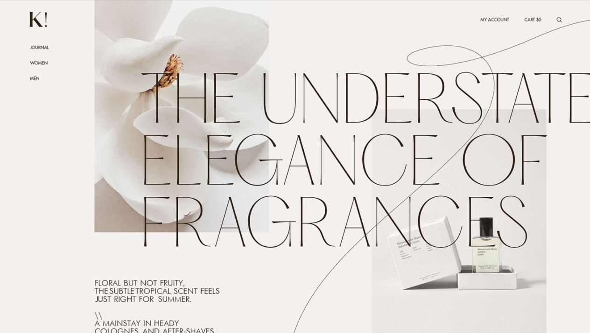
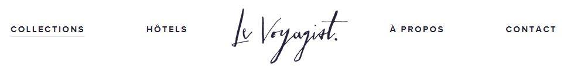

# projet-portfolio
Étudiante à la Haute Ecole de la Province de Liège (HEPL), projet pour le cours de Design web : https://github.com/hepl-dw/projet-portfolio

## Inspiration 

Le design avec les cercles ou courbes m'a beaucoup attiré( le grand cercle simple je voudrais animé) et les boutons aussi. 

Mettre surtout écriture(par exemple portfolio) en valeur grand avec une police dans la famille scriptes.

Navigation très simple avec un soulignement et faire un logo personnalisé avec mon prénom.

 
Je voudrais utilisé des couleurs très clair
